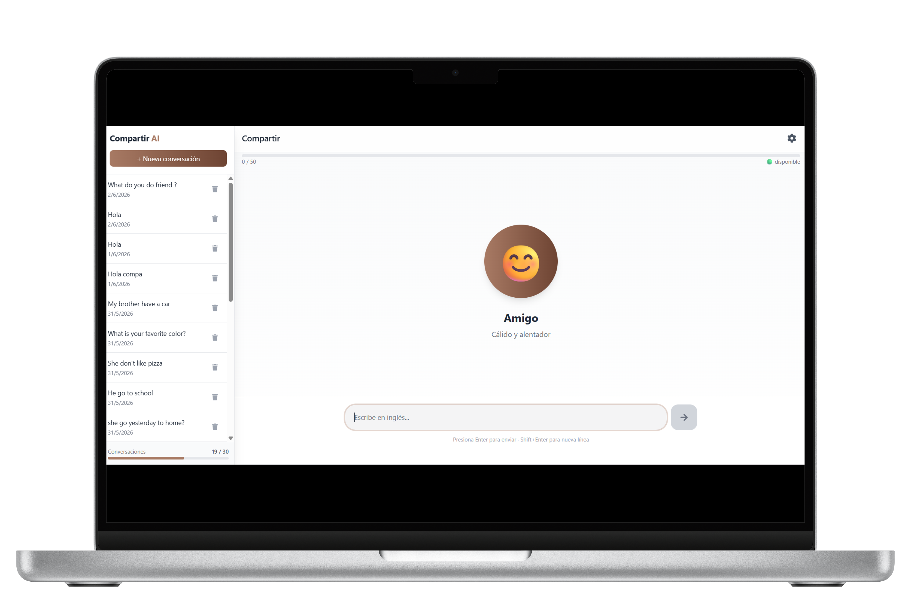
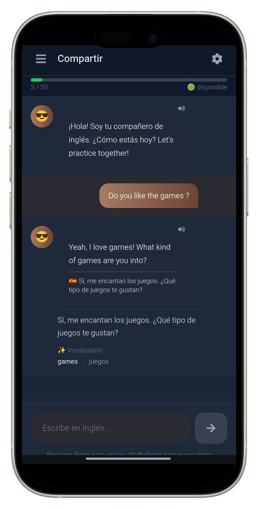
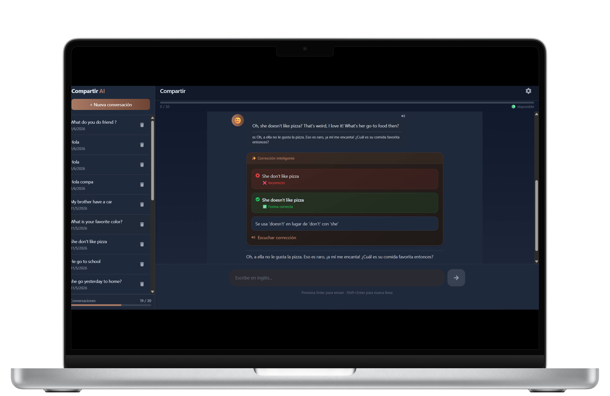
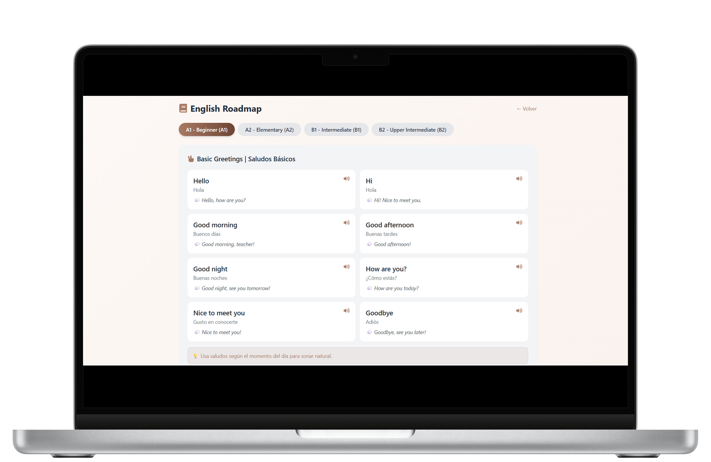

# 🗣️ COMPARTIR AI

<div align="center">

[](https://compartir-ai.vercel.app)
[](https://react.dev)
[](https://fastapi.tiangolo.com)
[](https://supabase.com)
[](https://tailwindcss.com)

**Aprende inglés conversando con una IA que te corrige, traduce y se adapta a tu personalidad.**

[🌐 Demo en vivo](https://compartir-ai.vercel.app) · [📝 Reportar error](https://github.com/DanielRodriguez9/compartir-ai/issues) · [📚 Documentación](#-instalación-local)

</div>

---

## 📸 Capturas de pantalla

<div align="center">
  
  <p><em>Landing page en desktop</em></p>
</div>

<div align="center">
  
  <p><em>Landing page en móvil</em></p>
</div>

<div align="center">
  
  <p><em>Chat conversando con la IA</em></p>
</div>

<div align="center">
  
  <p><em>Chat en versión móvil</em></p>
</div>

<div align="center">
  
  <p><em>La IA corrige errores y explica por qué</em></p>
</div>

<div align="center">
  
  <p><em>Roadmap de aprendizaje A1 → B2</em></p>
</div>

---

## ✨ Características

| Característica | Descripción |
|----------------|-------------|
| 🤖 **6 Personalidades** | Amigo, Mentor, Gamer, Viajero, Roomie, Calmado |
| 📝 **Corrección gramatical** | Detecta errores y explica por qué están mal |
| 🌐 **Traducción automática** | Inglés ↔ Español en tiempo real |
| 🔊 **Pronunciación natural** | Escucha las frases con voz IA |
| 📚 **Vocabulario destacado** | Palabras importantes con significado |
| 🌙 **Modo oscuro** | Interfaz adaptable a tu preferencia |
| 📱 **Responsive** | Funciona perfectamente en móvil y desktop |
| 📊 **Roadmap A1→B2** | Guía de aprendizaje estructurada |
| 🔐 **Autenticación Google** | Login seguro con Supabase |
| 💾 **Historial de chats** | Guarda y retoma conversaciones |

---

## 🛠️ Stack Tecnológico

### Frontend
| Tecnología | Uso |
|------------|-----|
| **React 19** | UI y componentes |
| **Vite** | Build tool y dev server |
| **TailwindCSS** | Estilos y responsive |
| **Framer Motion** | Animaciones |
| **React Router** | Navegación |
| **Supabase JS** | Autenticación |

### Backend
| Tecnología | Uso |
|------------|-----|
| **FastAPI** | API REST |
| **Groq (Llama 3.3)** | Modelo de IA para conversación |
| **Supabase** | Base de datos + Auth |
| **Uvicorn** | Servidor ASGI |

### DevOps
| Servicio | Uso |
|----------|-----|
| **Vercel** | Despliegue frontend |
| **Render** | Despliegue backend |
| **GitHub** | Control de versiones |

---

## 🚀 Demo en vivo

👉 [**https://compartir-ai.vercel.app**](https://compartir-ai.vercel.app)

**Credenciales de prueba:** Inicia sesión con tu cuenta de Google.

---

## 📦 Instalación local

### Requisitos previos
- Node.js 18+
- Python 3.12+
- Cuenta de Supabase (gratis)
- API Key de Groq (gratis)

### 1. Clonar el repositorio

```bash
git clone https://github.com/DanielRodriguez9/compartir-ai.git
cd compartir-ai

Configurar el backend

cd backend
python -m venv venv
source venv/bin/activate  # En Windows: venv\Scripts\activate
pip install -r requirements.txt

Crear archivo .env:

SUPABASE_URL=tu_url_de_supabase
SUPABASE_KEY=tu_service_role_key
GROQ_API_KEY=tu_api_key_de_groq


Ejecutar el servidor:

uvicorn app.main:app --reload --port 8001


Configurar el frontend

cd frontend
npm install


Crear archivo .env.local:

VITE_SUPABASE_URL=tu_url_de_supabase
VITE_SUPABASE_ANON_KEY=tu_anon_key

Ejecutar la aplicación : 
npm run dev


 Abrir la aplicación
Ve a http://localhost:5173


📁 Estructura del proyecto

compartir-ai/
├── backend/
│   ├── app/
│   │   ├── core/          # Configuración
│   │   ├── middleware/    # Autenticación
│   │   ├── routes/        # Endpoints API
│   │   ├── services/      # IA, traducción, gramática
│   │   └── main.py
│   └── requirements.txt
├── frontend/
│   ├── src/
│   │   ├── assets/        # Imágenes y recursos
│   │   ├── components/    # Componentes reutilizables
│   │   ├── context/       # Auth y Theme
│   │   ├── pages/         # Landing, Chat, Roadmap
│   │   ├── services/      # API calls
│   │   └── App.jsx
│   └── package.json
└── screenshots/           # Capturas de pantalla


```

---

📄 Licencia
MIT License - Libre para usar, modificar y distribuir.

---

👨‍💻 Autor
Daniel "Dcrypto" Rodriguez - Crypto Milovat

---

⭐ ¿Te gustó el proyecto?
Si este proyecto te ayudó o te pareció interesante:

Dale una estrella ⭐ en GitHub

Comparte el proyecto con otros

Reporta errores o sugiere mejoras

---

<div align="center"> <sub>Hecho con ❤️ para aprender inglés sin presión</sub> </div> 
